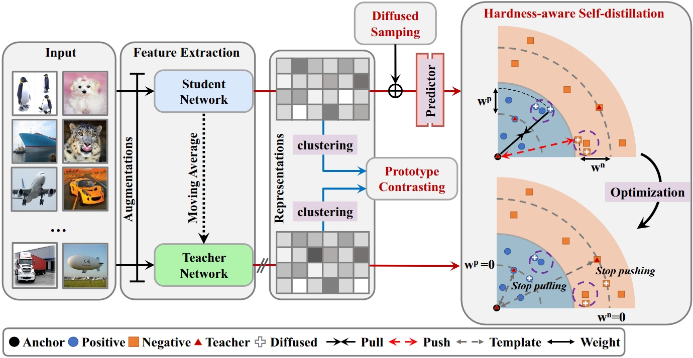
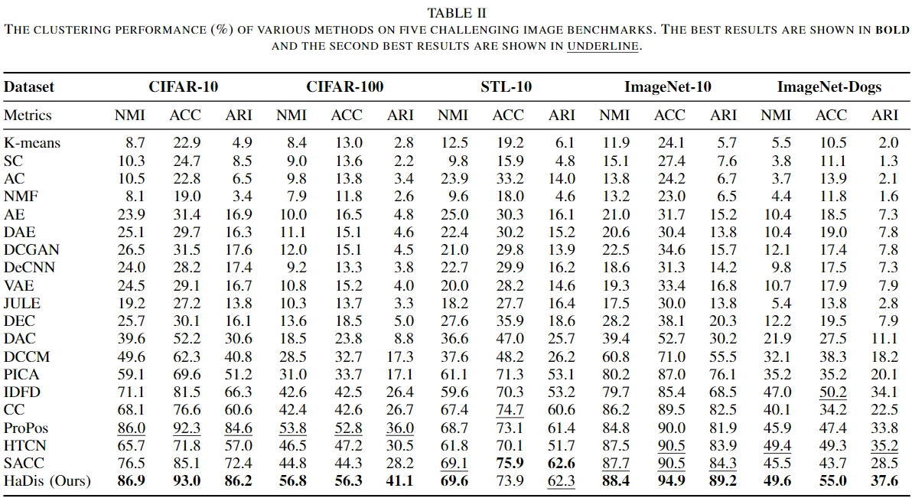

## Deep Clustering with Diffused Sampling and Hardness-aware Self-distillation

The official implementation of our [HaDis](https://arxiv.org/abs/2401.14038).

We have built new state-of-the-art performance on five benchmarked datasets.

> Deep Clustering with Diffused Sampling and Hardness-aware Self-distillation <br>
> https://arxiv.org/abs/2401.14038 <br>
> 
> Abstract: Deep clustering has gained significant attention due to its capability in learning clustering-friendly representations without labeled data. However, previous deep clustering methods tend to treat all samples equally, which neglect the variance in the latent distribution and the varying difficulty in classifying or clustering different samples. To address this, this paper proposes a novel end-to-end deep clustering method with diffused sampling and hardness-aware self-distillation (HaDis). Specifically, we first align one view of instances with another view via diffused sampling alignment (DSA), which helps improve the intra-cluster compactness. To alleviate the sampling bias, we present the hardness-aware self-distillation (HSD) mechanism to mine the hardest positive and negative samples and adaptively adjust their weights in a self-distillation fashion, which is able to deal with the potential imbalance in sample contributions during optimization. Further, the prototypical contrastive learning is incorporated to simultaneously enhance the inter-cluster separability and intra-cluster compactness. Experimental results on five challenging image datasets demonstrate the superior clustering performance of our HaDis method over the state-of-the-art.

**If you found this code helps your work, do not hesitate to cite my paper or star this repo!**

### Introduction

The detail implementations and the results can be found in `models/`, and in the following table 2, respectively.

##### Overall Framework



##### Main Results



Note that: For we have reproduced the  results  of  IDFD,  CC  and  ProPos  by  using  their  official code and strictly following the suggested settings.  For a fair comparison, we train all clustering approaches for 1,000 epochs. All  experiments  are  run  on  an NVIDIA GeForce RTX 3090 GPU.

### Training

#### Install requirements

Following ProPos, the kmeans and GMM clustering using pure PyTorch and the relative code can be found
at https://github.com/Hzzone/torch_clustering. Nevertheless, I have downloaded the torch_clustering package for you, so you do not need to install again.

Install requirements:

```shell
pip install -r requirements.txt
```

#### Download the datasets

The datasets used in HaDis can be downloaded from official websites.

#### Training Commands
The config files are in `config/`, just run the following command:
```shell
export CUDA_VISIBLE_DEVICES=0 # use the first GPU
torchrun --master_port 17673 --nproc_per_node=1 main.py config/cifar10_r18_propos.yml
```
or
```shell
export CUDA_VISIBLE_DEVICES=0 # use the first GPU
python -m torch.distributed.launch --nproc_per_node=1 --master_port=17672 main.py config/cifar10_r18_propos.yml
```

##### Aftering training, you can see the results including the logs of loss and metrics, and saved model.pth in`ckpt/`.

We can also enable the WANDB (default not wandb) to visualize the training!

Set the `wandb` parameters to true, and login to wandb.ai:
```shell
wandb login xxx
```

#### Visualize the learned representations

see `feature_visualization.py(recommended) or notebook/feature_visualization.ipynb` [](https://colab.research.google.com/github/Hzzone/ProPos/blob/master/notebook/feature_visualization.ipynb)

### Citation

If you found this code or our work useful please cite us:

```bibtex
@misc{zhang2024deep,
      title={Deep Clustering with Diffused Sampling and Hardness-aware Self-distillation}, 
      author={Hai-Xin Zhang and Dong Huang},
      year={2024},
      eprint={2401.14038},
      archivePrefix={arXiv},
      primaryClass={cs.CV}
}
```

Special thanks to the following paper:

```bibtex
@article{huang2022learning,
  title={Learning representation for clustering via prototype scattering and positive sampling},
  author={Huang, Zhizhong and Chen, Jie and Zhang, Junping and Shan, Hongming},
  journal={IEEE Transactions on Pattern Analysis and Machine Intelligence},
  year={2022},
  publisher={IEEE}
}

```

```bibtex
@inproceedings{liu2022improving,
  title={Improving Self-supervised Lightweight Model Learning via Hard-Aware Metric Distillation},
  author={Liu, Hao and Ye, Mang},
  booktitle={European Conference on Computer Vision},
  pages={295--311},
  year={2022},
  organization={Springer}
}

```
